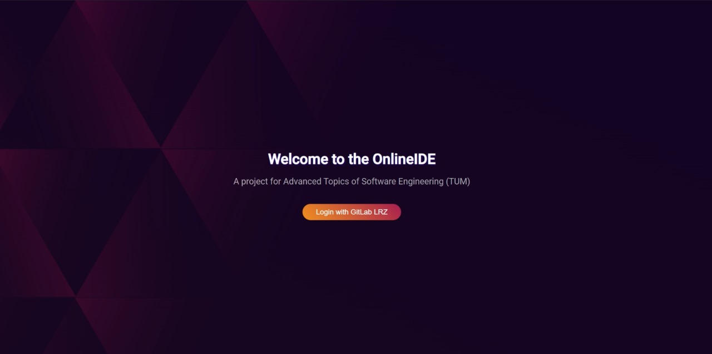
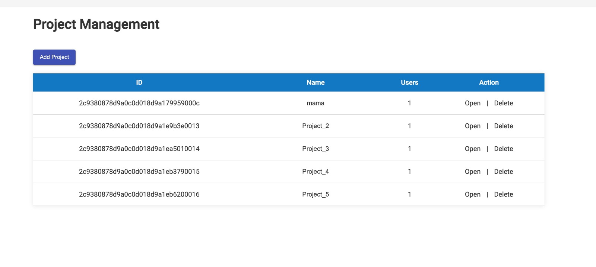

# OnlineIDE





## Add your files

- Clone the project directory:
- Clone the project directory:

```
cd existing_repo
git clone https://gitlab.lrz.de/ase23-seehamer-see/onlineide.git
```

## Build and run the microservices locally

- Run the following command in all the project directories in separate terminals to build  and start each service:
(e.g., `cd onlineide/backend`): \
PS: for darkmode it is `dark-mode/darkmode`

```
mvn clean compile 
mvn package
mvn spring-boot:run
```

## Build and run the microservices in docker containers

- Alternatively you can run all services also in local docker containers.
Start by running the script `build_services.sh` after setting ``chmod+x`` if you use linux OR `build_services_windows.ps1` if you use Windows.


- Once all the services are compiled and packaged, run the following commands to start the services in local docker containers.
```
docker-compose build # To build the images
docker-compose up    # To start the containers
```

## Test and Deploy

Use the built-in continuous integration in GitLab.

To  test the project in gitlab, triggering a change in a branch or manually triggering a pipeline will test the services.
If the pipeline is triggered on the main branch, all the microservices will be deployed to he GCP instance upon success (Address: http://34.125.30.158)

The frontend runs on port ``8084`` (or ``http://34.125.30.158:8084``)


***Important:***
Since we didn't have credits to run the pipelines using a cloud instance, we used a local (`Windows`) gitlab runner (can be found here: `https://gitlab.lrz.de/ase23-seehamer-see/onlineide/-/settings/ci_cd`). 
This means the personal laptop needs to be running when you want to test and deploy changes.

***

To  test the project in gitlab, triggering a change in a branch or manually triggering a pipeline will test the services.
If the pipeline is triggered on the main branch, all the microservices will be deployed to he GCP instance upon success (Address: http://34.125.30.158)

The frontend runs on port ``8084`` (or ``http://34.125.30.158:8084``)


***Important:***
Since we didn't have credits to run the pipelines using a cloud instance, we used a local (`Windows`) gitlab runner (can be found here: `https://gitlab.lrz.de/ase23-seehamer-see/onlineide/-/settings/ci_cd`). 
This means the personal laptop needs to be running when you want to test and deploy changes.

***


## License
For open source projects, say how it is licensed.

## Project status
The project is submitted as part of bonus exercise of the `Advanced Topics of Software Engineering` lecture.
The project is submitted as part of bonus exercise of the `Advanced Topics of Software Engineering` lecture.
